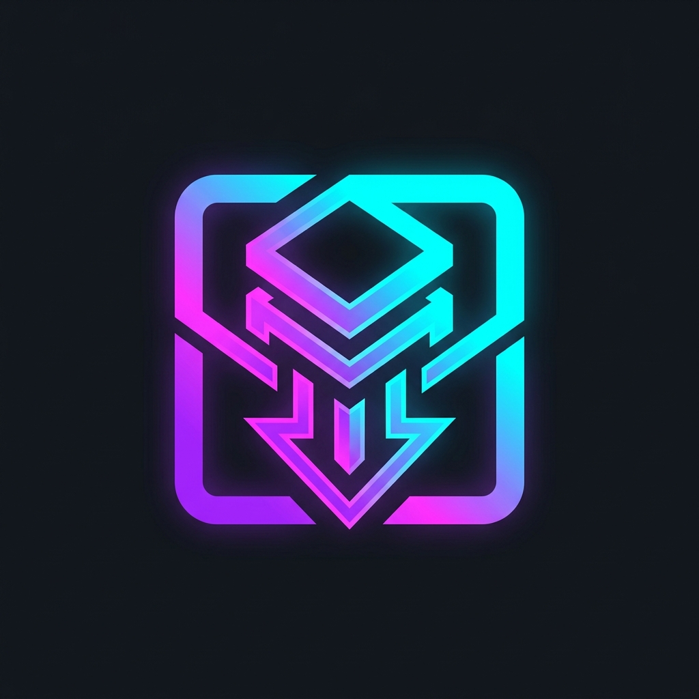
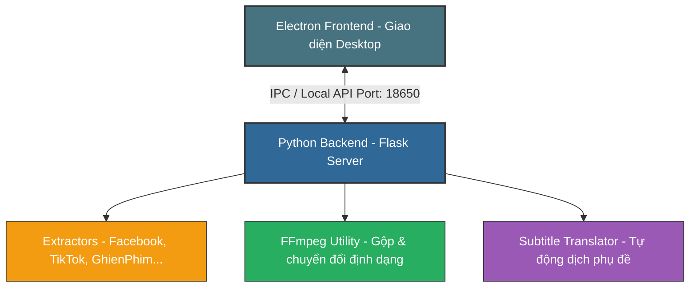

<p align="center">
  
</p>

<h1 align="center">🚀 EveryThingDownloader</h1>

<p align="center">
  <strong>Giải pháp tải đa phương tiện toàn năng, bảo mật tối đa và tự động hóa phát hành vượt trội</strong>
</p>

<p align="center">
  <a href="https://github.com/m3iK18dp/EveryThingDownloader/releases">
    
  </a>
  <a href="#">
    
  </a>
  <a href="#">
    
  </a>
  <a href="#">
    
  </a>
  <a href="LICENSE">
    
  </a>
</p>

---

## 🌟 Giới thiệu tổng quan

**EveryThingDownloader** không chỉ đơn thuần là một công cụ tải video. Đây là một **hệ sinh thái tải đa phương tiện hoàn chỉnh và bảo mật**, kết hợp hoàn hảo giữa hiệu năng xử lý mạnh mẽ của Backend Python (Flask) và trải nghiệm giao diện người dùng Desktop mượt mà, trực quan của Electron.

Bên cạnh khả năng giải mã và tải xuống từ hàng loạt nền tảng lớn (Facebook, TikTok, Youtube, GhienPhim, MotChill...), dự án còn được trang bị **Build Tool độc quyền** hỗ trợ xáo trộn mã nguồn (AST Obfuscation), mã hóa nhị phân (PyArmor) và quản lý bản quyền (IP Lock, Expiry Date Lock, Hardware Fingerprint). Điều này cho phép bạn đóng gói ứng dụng thành tệp thực thi thương mại độc lập `.exe` một cách an toàn nhất.

---

## ✨ Tính năng nổi bật

### 📥 1. Bộ Công Cụ Tải Xuống Đa Nguồn (Media Downloader)
* 🌐 **Mạng xã hội phổ biến**: 
  * **Facebook**: Tải video chất lượng HD/SD, Reels, Video từ các group công khai/riêng tư.
  * **TikTok**: Tự động bóc tách và tải video không logo (No Watermark), tải file nhạc nền riêng biệt.
  * **Instagram**: Hỗ trợ Reels, Stories, IGTV và bài viết hình ảnh chất lượng gốc.
  * **Twitter (X)** / **Pinterest** / **Reddit** / **Threads**: Tự động gộp luồng hình ảnh, video và âm thanh riêng lẻ thành tệp MP4 chất lượng cao nhất thông qua FFmpeg.
* 🎬 **Giải mã Web phim (GhienPhim, MotChill...)**: Tích hợp trình duyệt ảo ngầm (Headless Browser/Iframe Resolver) để giải mã các đường dẫn phim được giấu sâu sau nhiều lớp Iframe quảng cáo hoặc các luồng phát dạng HLS/DASH (M3U8/MPD) mã hóa nhẹ.
* 📝 **Xử lý phụ đề thông minh**:
  * Tự động phát hiện, trích xuất phụ đề gốc.
  * Chuyển đổi định dạng phụ đề linh hoạt (ví dụ: YouTube TimedText sang WebVTT).
  * **Auto-Translation**: Tích hợp API tự động dịch phụ đề tiếng nước ngoài sang Tiếng Việt chuẩn xác trước khi lưu.

### 🛡️ 2. Hệ Thống Bảo Vệ Bản Quyền & Chống Dịch Ngược (Build Tool)
* 🧩 **AST Code Scrambling**: Tự động phân tích cây cú pháp trừu tượng (AST) của Python để xáo trộn tên biến, tên hàm, mã hóa chuỗi ký tự cục bộ, phá hỏng khả năng đọc hiểu của các công cụ dịch ngược (decompiler).
* 🔒 **PyArmor Binary Security**: Mã hóa nhị phân tệp thực thi Flask để bảo vệ tối đa thuật toán cốt lõi.
* 🎫 **Ràng buộc bản quyền (Licensing)**:
  * **IP Address Lock**: Khóa cứng ứng dụng chỉ được phép hoạt động trên các địa chỉ IP được cấp phép.
  * **Expiry Date Lock**: Thiết lập thời hạn dùng thử (Trial period). App sẽ tự động khóa và hiển thị thông báo hết hạn khi vượt mốc thời gian cấu hình.
  * **Hardware Fingerprint (Machine ID)**: Đăng ký bản quyền dựa trên dấu vân tay phần cứng duy nhất (Mainboard UUID, CPU ID). Ngăn chặn hành vi phân phối lậu hoặc sao chép phần mềm sang máy tính khác.

### 💻 3. Electron Desktop UX/UI Cao Cấp
* 🎨 **Giao diện Frameless**: Cửa sổ không viền hiện đại, bo góc thời thượng theo phong cách Windows 11 cùng hệ màu Dark Mode lôi cuốn.
* 📥 **Khay hệ thống (System Tray) đa năng**:
  * Khi nhấn nút đóng (X), ứng dụng sẽ thu nhỏ chạy ẩn dưới khay hệ thống giúp tiết kiệm tài nguyên và giữ kết nối tải xuống liên tục.
  * Bật/Tắt nhanh tính năng khởi động cùng Windows (Start with Windows) thông qua Registry tự động.
  * Menu chuột phải tiện ích: Khởi động lại máy chủ ngầm (Restart Backend) chỉ với 1 click khi gặp sự cố mạng, mở nhanh thư mục tải xuống, mở giao diện trên trình duyệt mặc định.
* 🔄 **Single-Instance Restoring**: Ngăn chặn chạy trùng lặp nhiều tiến trình app. Nhấp đúp vào file `.exe` hoặc icon khay hệ thống khi ứng dụng đang chạy ngầm sẽ tự động khôi phục và đưa giao diện lên trên cùng.

---

## 🛠️ Sơ đồ Kiến trúc & Luồng Hoạt động



---

## ⚙️ Công Nghệ Sử Dụng

* **Core Backend**: Python 3.12, Flask, Flask-CORS, SQLite (lưu cấu hình), PyInstaller, PyArmor.
* **Core Frontend**: Electron (v28+), HTML5, Vanilla CSS (Thiết kế giao diện Dark Mode cao cấp), JavaScript (ES6+).
* **Công cụ bổ trợ**: FFmpeg (xử lý media), Playwright/Puppeteer-like Headless parser (giải mã iframe).
* **Phát hành & Tự động hóa**: GitHub Actions (CI/CD), Electron Builder, NSIS Installer.

---

## 🚀 Hướng Dẫn Phát Triển (Development)

### Yêu cầu hệ thống
* **Python**: `3.12.x` trở lên
* **Node.js**: `20.x` hoặc `22.x`
* **FFmpeg**: Đã được cài đặt và thêm vào đường dẫn môi trường (PATH) của hệ thống.

### Thiết lập môi trường chạy thử (Dev Mode)

1. **Khởi chạy Python Backend**:
   ```bash
   # Tạo và kích hoạt môi trường ảo
   python -m venv venv
   source venv/bin/activate  # Trên Linux/macOS
   # Hoặc trên Windows:
   # venv\Scripts\activate

   # Cài đặt thư viện dependencies
   pip install -r requirements.txt

   # Khởi chạy Flask Server (chế độ dev)
   python app.py
   ```

2. **Khởi chạy Electron Frontend**:
   ```bash
   cd electron
   npm install
   npm run dev
   ```

---

## 📦 Đóng Gói & Phát Hành (Production Build)

EveryThingDownloader tích hợp bộ công cụ đóng gói thông minh hỗ trợ cả giao diện đồ họa Web GUI trực quan lẫn dòng lệnh CLI mạnh mẽ.

### Cách 1: Sử dụng Web Build GUI (Khuyên dùng)
1. Khởi chạy máy chủ Build GUI:
   ```bash
   python build_tool/builder_cli.py --gui
   ```
2. Truy cập địa chỉ `http://127.0.0.1:18651/` bằng trình duyệt web.
3. Tùy chỉnh các tham số bảo mật:
   - **Obfuscate Code**: Bật xáo trộn mã nguồn.
   - **IP Lock / Expiry Date / Machine ID**: Nhập cấu hình bản quyền tương ứng.
4. Bấm **Start Build** để tiến hành đóng gói tự động.

### Cách 2: Sử dụng dòng lệnh CLI
```bash
# Chỉ build bản chạy trên trình duyệt Web (Web Target) có xáo trộn code
python build_tool/builder_cli.py --target web --obfuscate

# Build đầy đủ bản Desktop App (.exe Setup & Portable)
python build_tool/builder_cli.py --target desktop --obfuscate --name EveryThingDownloader --version 1.0.0
```

---

## ☁️ Quy Trình Tự Động Hóa Phát Hành (Automated Release CI/CD)

Dự án sử dụng **GitHub Actions** để tự động hóa hoàn toàn quy trình đóng gói và phát hành ứng dụng mỗi khi có phiên bản mới:

1. **Gắn thẻ phiên bản**:
   ```bash
   git tag v1.0.1
   git push origin v1.0.1
   ```
2. **Biên dịch trên mây**: GitHub Actions sẽ tự động kích hoạt một máy ảo Windows trên GitHub, tải mã nguồn, cài đặt môi trường, biên dịch backend sang `.exe`, đóng gói Electron installer, và tải lên mục **Releases** của kho lưu trữ công khai.
3. **Đẩy cập nhật**: Hệ thống tự động cập nhật file `update.json` công khai chứa thông tin phiên bản mới nhất cùng đường dẫn tải về. Ứng dụng của người dùng sẽ tự động nhận diện bản cập nhật tiếp theo.

---

## 📝 Giấy Phép & Bản Quyền

Dự án được phát hành theo giấy phép **MIT License**. 
Bản quyền thuộc về **EveryThingDownloader Team © 2026**.
